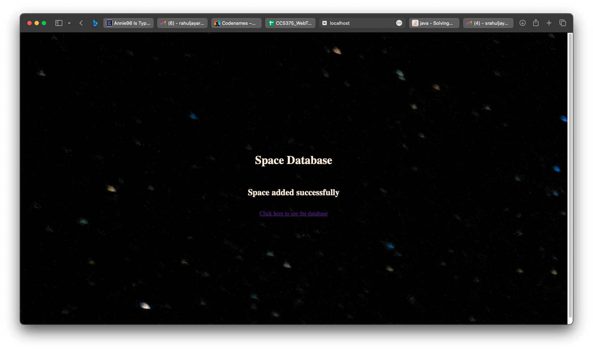

<h1 align="center">Image Mapping</h1>

- Ex No. : 1
- Date : 

# Aim
The aim of this exercise is to understand and implement image mapping in HTML. Image mapping enables the creation of clickable regions on an image, linking each area to different destinations, thereby enhancing user interaction and navigation on web pages.

# Procedure
1. Create an HTML File: Initiate an HTML file and insert an image utilizing the  tag.
2. Implement Image Map: Utilize the usemap attribute within the  tag to associate the image with a map.
3. Define Map: Use the <map> tag with a unique name, specifying the clickable areas using the <area> tag.
4. Utilize the shape attribute to define the shape of the area (e.g., rectangle, circle, polygon).
5. Specify the coords attribute to determine the coordinates of the area.
6. Employ the href attribute within the <area> tag to indicate the link destination.
7. Style and Enhance: Add CSS to customize the appearance of the map and associated elements for better visual representation.
8. Test and Review: Test the functionality of the created image map to ensure the accuracy of clickable regions and their linked destinations.

# Program
* index.html
```html
<!DOCTYPE html>
<html lang="en">
<head>
    <meta charset="UTF-8">
    <meta name="viewport" content="width=device-width, initial-scale=1.0">
    <title>Solar Map</title>
    <style>
        body {
            color: #CCCCCC;
        }
        .solar {
            display: flex;
            flex-direction: column;
            align-items: center;
            justify-content: center;
        }
        #title:hover {
            transform: scale(1.1);
        }
    </style>
</head>
<body style="background: url('Starry_Background.jpg')">
        <map name="SolarMap">
            <area shape="circle" coords="680 340 80" alt="Jupiter" href="https://solarsystem.nasa.gov/planets/jupiter/overview/" target="_blank" />
            <area shape="polygon" coords="230 330 340 325 390 270 460 330 540 345 455 350 380 400 330 350" alt="Saturn" href="https://solarsystem.nasa.gov/planets/saturn/overview/" target="_blank" />
            <area shape="circle" coords="920 340 10" alt="Earth" href="https://solarsystem.nasa.gov/planets/earth/overview/" target="_blank" />
            <area shape="rect" coords="1070 0 1200 670" alt="Sun" href="https://solarsystem.nasa.gov/solar-system/sun/overview/" target="_blank" />
        </map>
    <div class="solar">
        <h2 id="title" style="text-align: center;">Solar Photo Map</h2>
        
    </div>

</body>
</html>
```

# Output


# Result
The implementation of image mapping was successful. The image map was created and the clickable regions were linked to their respective destinations.

<div style="page-break-after: always"></div>

<h1 align="center">CSS (Internal, External, Inline)</h1>

- Ex No. : 2
- Date : 

# Aim
The objective of this exercise is to explore and implement various approaches to apply Cascading Style Sheets (CSS) within an HTML document. The aim is to comprehend the three primary methods of incorporating CSS—internal, external, and inline—offering flexibility and control over the presentation and styling of HTML content.

# Procedure
1. Create HTML Structure: Develop an HTML file and incorporate content representing the subject matter.
2. Implement Internal CSS: Insert a <style> tag within the HTML's <head> section to apply internal CSS styles directly to the document.
3. External CSS Linkage: Create an external CSS file, and use the <link> tag within the HTML to connect the external CSS file to the document, enabling centralized and reusable styling.
4. Utilize Inline CSS: Apply inline CSS directly to specific HTML elements for targeted styling.
5. Styling the Content: Define and customize CSS rules to enhance the appearance, layout, and interactivity of the HTML content. Employ selectors and properties to style elements and create visual effects.
6. Testing and Verification: Ensure the proper application of each CSS method and verify that the styling is correctly reflected in the HTML content.

# Program
* index.html
```html
<!DOCTYPE html>
<html lang="en">
<head>
    <meta charset="UTF-8">
    <meta name="viewport" content="width=device-width, initial-scale=1.0">
    <title>Types of Galaxies</title>
    <!-- External CSS-->
    <link rel="stylesheet" href="index.css">
    <!-- Internal CSS-->
    <style>
        .container{
            display: flex;
            flex-direction: row;
            flex-wrap: wrap;
            justify-content: center;
            align-items: center;
        }
    </style>
</head>
<body style="background-image: url('Starry_Background.jpg');">
    <!-- Inline CSS-->
    <h1 style="text-align: center; color: white;">Types of Galaxies</h1>
    <div class="container">
        <div class="card">
            
            <div class="card-body">
                <h1>Spiral Galaxies</h1>
                <p>These galaxies resemble giant rotating pinwheels with a pancake-like disk of stars and a central bulge or tight concentration of stars.</p>
            </div>
        </div>
        <div class="card">
            
            <div class="card-body">
                <h1>Elliptical Galaxies</h1>
                <p>Unlike spirals, elliptical galaxies usually contain little gas and dust and show very little organization or structure. The stars orbit around the core in random directions and are generally older than those in spiral galaxies since little of the gas needed to form new stars remains</p>
            </div>
        </div>
        <div class="card">
            
            <div class="card-body">
                <h1>Lenticular Galaxies</h1>
                <p>Lenticular galaxies are a kind of cross between spirals and ellipticals. They have the central bulge and disk common to spiral galaxies but no arms. But like ellipticals, lenticular galaxies have older stellar populations and little ongoing star formation.</p>
            </div>
        </div>
    </div>
</body>
</html>
```
* index.css
```css
.card {
    width: 400px;
    /* height: 300px; */
    background-color: rgba(0, 0, 0, 0.2);
    color: white;
    border-radius: 10px;
    box-shadow: 0 0 10px rgba(0, 0, 0, 0.2);
    overflow: hidden;
    position: relative;
    margin: 20px;
    display: inline-block;
    vertical-align: top;
    transition: all 0.3s ease-in-out;
}

.card:hover {
    transform: scale(1.1);
    box-shadow: 0 0 20px rgba(0, 0, 0, 0.2);
}

.card .card-img {
    width: 50%;
    height: 50%;
    border-radius: 10px;
    background-size: cover;
    background-position: center;
    background-repeat: no-repeat;
    transition: all 0.3s ease-in-out;
}

.card .card-content {
    position: absolute;
    bottom: 0;
    left: 0;
    width: 100%;
    padding: 20px;
    box-sizing: border-box;
    color: #fff;
}
```

# Output


# Result
The implementation of CSS was successful. The HTML content was styled using the three methods of CSS—internal, external, and inline.

<div style="page-break-after: always"></div>

<h1 align="center">Javascript Form Validation</h1>

- Ex No. : 3
- Date : 

# Aim
The primary goal of this exercise is to understand and implement JavaScript-based form validation. This involves leveraging JavaScript to ensure the accuracy and integrity of user inputs within a web form, in this case, for selecting space-related data. The objective is to provide real-time validation and fetch specific space data based on the user's selection.

# Procedure
1. HTML Structure Setup: Develop an HTML structure containing three distinct components: a header, a main section for form input and data display, and a footer.
2. CSS Styling: Define CSS rules to style the HTML components, making use of various selectors to achieve a visually appealing layout and design.
Form and Selection: Implement a form with a selection dropdown to choose various planets, and attach an event listener to the form to trigger form submission.
3. JavaScript Validation Logic:
- Handle Submission: Create a function (handleSubmit) to manage form submission, preventing default behavior and fetching space data based on the selected planet.
- Handle Selection: Set up a function (handleSelect) to capture the selected planet from the dropdown menu.
4. Integration of JavaScript: Link the JavaScript file (script.js) to the HTML to incorporate the validation logic into the form and enable data retrieval based on the user's selection.
5. API Integration: Utilize an API (https://api.le-systeme-solaire.net) to retrieve specific planet-related data using the selected planet.
Testing and Execution: Validate the form by selecting different planets and observing the fetched space data, ensuring the accuracy and responsiveness of the form validation and data presentation.

# Program
* index.html
```html
<!DOCTYPE html>
<html lang="en">
<head>
    <meta charset="UTF-8">
    <meta name="viewport" content="width=device-width, initial-scale=1.0">
    <title>Space Data Validation</title>

</head>
    <frameset rows="5%, 50%, 5%">
        <frame src="header.html" name="header">
        <frame src="main.html" name="main">
        <frame src="footer.html" name="footer">
    </frameset>
</html>
```
* header.html
```html
<!DOCTYPE html>
<html lang="en">
<head>
    <meta charset="UTF-8">
    <meta name="viewport" content="width=device-width, initial-scale=1.0">
    <title>Navbar</title>
    <link rel="stylesheet" type="text/css" href="style.css">
</head>
<body>
    <nav>
        <center>
            <h1>Space Data Validation</h1>
        </center>
    </nav>
</body>
</html>
```
* main.html
```html
<!DOCTYPE html>
<html lang="en">
  <head>
    <meta charset="UTF-8" />
    <meta name="viewport" content="width=device-width, initial-scale=1.0" />
    <title>Main</title>
    <link rel="stylesheet" type="text/css" href="style.css" />
  </head>
  <body>
    <div class="flex-row">
      <form class="flex-col" onsubmit="handleSubmit(event)">
        <label for="planet">Select a Planet</label>
        <select id="planet" onchange="handleSelect(event)">
          <option value="-">-</option>
          <option value="mercury">Mercury</option>
          <option value="venus">Venus</option>
          <option value="earth">Earth</option>
          <option value="mars">Mars</option>
          <option value="jupiter">Jupiter</option>
          <option value="saturn">Saturn</option>
          <option value="uranus">Uranus</option>
          <option value="neptune">Neptune</option>
        </select>
        <input type="submit" value="Fetch" />
      </form>
      <div class="flex-col" id="data"></div>
    </div>
    <script src="script.js"></script>
  </body>
</html>
```
* footer.html
```html
<!DOCTYPE html>
<html lang="en">
<head>
    <meta charset="UTF-8">
    <meta name="viewport" content="width=device-width, initial-scale=1.0">
    <title>Footer</title>
    <link rel="stylesheet" type="text/css" href="style.css">
</head>
<body>
    <footer>
        <center>
            <h6>Copyright <sup>©</sup>2023</h6>
        </center>
    </footer>
</body>
</html>
```
* style.css
```css
html {
    background-image: url("../Starry_Background.jpg");
    color:antiquewhite;
}

input {
    height: 2rem;
    width: 7rem;
    border-radius: 0.5rem;
    border: none;
    padding: 0.5rem;
    margin: 0.5rem 0;
}

input[type="submit"] {
    background-color: #4CAF50;
    color: white;
    cursor: pointer;
    scale: 1;
    transition: all 0.5s ease-in-out;
}

input[type="submit"]:hover {
    background-color: #45a049;
    scale: 1.1;
    transition: all 0.5s ease-in-out;
}

label {
    font-size: 1.5rem;
}

select {
    height: 2rem;
    width: 10rem;
    border-radius: 0.5rem;
    border: none;
    padding: 0.5rem;
    margin: 0.5rem 0;
}

.flex-col {
    display: flex;
    flex-direction: column;
    justify-content: center;
    align-items: center;
    gap: 1rem;
    height: 100vh;
}

.flex-row {
    display: flex;
    flex-direction: row;
    justify-content: space-evenly;
    align-items: center;
    gap: 1rem;
}
```
* script.js
```js
let planet;

const handleSubmit = async (e) => {
    e.preventDefault();
    const data = document.getElementById('data');
    const planetspacedata = await fetch(`https://api.le-systeme-solaire.net/rest/bodies/${planet}`);
    const planetdata = await planetspacedata.json();
    data.innerHTML = `
        <h2>${planetdata.englishName}</h2>
        <div class="flex-row">
            <p>Gravity: ${planetdata.gravity}</p>
            <p>Mass: ${planetdata.mass.massValue} ${planetdata.mass.massExponent}</p>
        </div>
        <div class="flex-row">
            <p>Mean Radius: ${planetdata.meanRadius} km</p>
            <p>Escape Velocity: ${planetdata.escape}</p>
        </div>
        <div class="flex-row">
            <p>Rotation Period: ${planetdata.sideralRotation}</p>
            <p>Rotation Velocity: ${planetdata.sideralRotation}</p>
        </div>
        <p>Gravity: ${planetdata.gravity}</p>
    `;

}

const handleSelect = (e) => {
    planet = e.target.value;
}
```

# Output


# Result
The implementation of JavaScript-based form validation was successful. The form was validated in real-time, and the space data was fetched based on the user's selection.

<div style="page-break-after: always"></div>

<h1 align="center">Installation of Tomcat</h1>

- Ex No. : 4
- Date :

# Aim
The aim of this exercise is to learn about the installation of Tomcat.

# Procedure
Ex.No: 4

Installation of Apache Tomcat Web Server
Date: 

Aim:
To install Apache Tomcat web server.

Procedure:
1. Create a folder to keep all your works.
2. Download and install Apache Tomcat separately OR install XAMPP package which comes with both Apache server and Tomcat.
3. Check if Java is installed. If not, install it
4. Go to Windows environment variables and make sure that both JDK and JRE binaries are added to Path.
5. Configure the Tomcat server.
6. Start Tomcat server.
- Note: The Tomcat's executable programs and scripts are kept in the "bin" sub-directory of the Tomcat installed directory.
- For Windows, suppose Tomcat is installed in location “C:\xampp\tomcat”  (which is the default location in case of Xampp installation).

#### Launch a CMD shell command issue:

```C:	[ Change drive ]

cd \xampp\tomcat\bin	[ Change directory to Tomcat's binary directory startup ]

startup	[ Run startup.bat to start tomcat server ]
```

7. Open a web browser of your choice (Chrome, Firefox, Bing) which acts as an HTTP client. Type the URL "localhost:8080" to view the Tomcat server's welcome page. 

- The hostname “localhost” which refers to the IP address 127.0.0.1 is meant for local loop-back testing within the same machine.

8. For users on the other machines over the net, they have to use the server's IP address or DNS domain name in the form of "http://serverHostnameOrIPAddress:8080".

9. Try opening “http://localhost:8080/examples” to view the servlet and JSP examples. Try running some of the servlet examples.


10. Shutdown the Server
- For Windows, you can shut down the tomcat server by either:
- Press ‘Ctrl’ + ‘C’ on the Tomcat console.

#### Run "<TOMCAT_HOME>\bin\shutdown.bat" script. 


- Open a new cmd terminal and issue: C:	[ Change the current drive ]

``` 
cd \xampp\tomcat\bin	[ Change directory to your Tomcat's binary directory ]

shutdown 	[ Run shutdown.bat to shutdown the server ]
```

# Result:
Thus, Apache Tomcat web server has been installed successfully.

<div style="page-break-after: always"></div>

<h1 align="center">Simple Servlet Calling from HTML File</h1>

- Ex No. : 5A
- Date : 

# Aim
The goal of this exercise is to comprehend servlets and understand their invocation from an HTML file. The focus is on linking an HTML file to a Java Servlet to display space-related data through the servlet upon a user-triggered action.

# Procedure
1. Java Project Setup:
- Create a Java project.
- Add a servlet to the project.
2. web.xml Configuration:
- Configure the servlet within the web.xml file, mapping the servlet to a URL pattern.
3. HTML Setup:
- Craft an HTML file containing an anchor tag to invoke the space servlet.
4. Servlet Implementation:
- Develop the Servlet in Java to generate space-related data.
- Write the logic to handle HTTP GET requests.
5. Styling with CSS:
- Define a CSS file to style the HTML elements for a visually appealing display.
6. Integration and Execution:
- Ensure the successful integration of the HTML file with the servlet.
- Test the functionality by clicking on the anchor link to access the space-related data provided by the servlet.

# Program
* index.html
```html
<!DOCTYPE html>
<html lang="en">
<head>
    <meta charset="UTF-8">
    <meta name="viewport" content="width=device-width, initial-scale=1.0">
    <link rel="stylesheet" href="style.css" />
    <title>Servlet Basics</title>
</head>
<body>
    <div class="flex-col">
        <h1>Servlet Basics</h1>
        <a href="spaceservlet">Access Space Servlet</button>
    </div>
</body>
</html>
```
* SpaceServlet.java
```java
import java.io.*;
import javax.servlet.*;
import javax.servlet.http.*;

public class SpaceServlet extends HttpServlet {
    public void doGet(HttpServletRequest request, HttpServletResponse response) throws ServletException, IOException {
        PrintWriter out = response.getWriter();
        out.println("<html><head>");
        out.println("<link rel='stylesheet' href='style.css' /> <title>Space Servlet</title></head>");
        out.println("<body class='flex-col'><h1>Space Servlet</h1>");
        out.println("<table><tr><th>Planet</th><th>Distance</th></tr>");
        out.println("<tr><td>Mercury</td><td>57,910,000</td></tr>");
        out.println("</table></body></html>");
    }
}
```
* web.xml
```xml
<web-app>
    <servlet>
      <servlet-name>SpaceServlet</servlet-name>
      <servlet-class>SpaceServlet</servlet-class>
    </servlet>

    <servlet-mapping>
        <servlet-name>SpaceServlet</servlet-name>
        <url-pattern>/spaceservlet</url-pattern>
    </servlet-mapping>
</web-app>
```
* style.css
```css
html {
    background-image: url("./Starry_Background.jpg");
    color:antiquewhite;
}

input,a {
    border-radius: 0.5rem;
    border: none;
    padding: 0.5rem;
    margin: 0.5rem 0;
}

a {
    background-color: #4CAF50;
    color: white;
    cursor: pointer;
    text-decoration: none;
    scale: 1;
    transition: all 0.5s ease-in-out;
}

a:hover {
    background-color: #45a049;
    scale: 1.1;
    transition: all 0.5s ease-in-out;
}

label {
    font-size: 1.5rem;
}

select {
    height: 2rem;
    width: 10rem;
    border-radius: 0.5rem;
    border: none;
    padding: 0.5rem;
    margin: 0.5rem 0;
}

.flex-col {
    display: flex;
    flex-direction: column;
    justify-content: center;
    align-items: center;
    gap: 1rem;
    height: 100vh;
}
```

# Output


<div style="page-break-after: always"></div>

<h1 align="center">Form Printing using Servlets</h1>

- Ex No. : 5B
- Date :

# Aim
The aim here is to gain a comprehensive understanding of servlets and how they interact with HTML forms. The objective is to use a Java Servlet to retrieve and print user-submitted data from an HTML form onto a web page.

# Procedure
1. Java Project and Servlet Setup:
- Set up a Java project.
- Implement a servlet for data retrieval.
2. web.xml Configuration:
- Configure the servlet within the web.xml file, mapping it to a specific URL pattern.
3. HTML Form Creation:
- Craft an HTML form that captures user input, specifically for entering a planet's name.
4. Servlet Functionality:
- Design a servlet in Java to process HTTP POST requests, retrieving and displaying the planet name submitted via the form.
5. Styling with CSS:
- Define a CSS file to style the HTML form and elements for an enhanced visual representation.
6. Integration and Execution:
- Verify the form submission and data retrieval by inputting a planet's name and observing the servlet's presentation of the entered data onto the web page.

# Program
* index.html
```html
<!DOCTYPE html>
<html lang="en">
<head>
    <meta charset="UTF-8">
    <meta name="viewport" content="width=, initial-scale=1.0">
    <link rel="stylesheet" href="style.css" />
    <title>Space Form Printing</title>
</head>
<body>
    <div class="flex-col">
        <h1>Space Form Printing</h1>
        <form class="flex-col" action="spaceform" method="post">
            <label for="planet">Enter a Planet</label>
            <input type="name" id="planet" name="planet" placeholder="Enter the planet Name" />
            <input type="submit" value="Print" />
          </form>
    </div>
</body>
</html>
```
* SpaceForm.java
```java
import java.io.*;
import javax.servlet.*;
import javax.servlet.http.*;

public class SpaceForm extends HttpServlet {
    public void doPost(HttpServletRequest request, HttpServletResponse response) throws ServletException, IOException {
        PrintWriter out = response.getWriter();
        out.println("<html><head>");
        out.println("<link rel='stylesheet' href='style.css' /> <title>Space Form</title></head>");
        out.println("<body class='flex-col'><h1>Space Form</h1>");
        out.println("<h2>Planet: " + request.getParameter("planet") + "</h2>");
        out.println("</body></html>");
    }
}
```
* web.xml
```xml
<web-app>
    <servlet>
      <servlet-name>SpaceForm</servlet-name>
      <servlet-class>SpaceForm</servlet-class>
    </servlet>

    <servlet-mapping>
        <servlet-name>SpaceForm</servlet-name>
        <url-pattern>/spaceform</url-pattern>
    </servlet-mapping>
</web-app>
```

* style.css
```css
html {
    background-image: url("./Starry_Background.jpg");
    color:antiquewhite;
}

input {
    height: 2rem;
    width: 7rem;
    border-radius: 0.5rem;
    border: none;
    padding: 0.5rem;
    margin: 0.5rem 0;
}

input[type="submit"] {
    background-color: #4CAF50;
    color: white;
    cursor: pointer;
    scale: 1;
    transition: all 0.5s ease-in-out;
}

input[type="submit"]:hover {
    background-color: #45a049;
    scale: 1.1;
    transition: all 0.5s ease-in-out;
}

label {
    font-size: 1.5rem;
}

select {
    height: 2rem;
    width: 10rem;
    border-radius: 0.5rem;
    border: none;
    padding: 0.5rem;
    margin: 0.5rem 0;
}

.flex-col {
    display: flex;
    flex-direction: column;
    justify-content: center;
    align-items: center;
    gap: 1rem;
    height: 100vh;
}
```

# Output


# Result
The implementation of servlets was successful. The servlet was able to retrieve and print the user-submitted data onto the web page.

<div style="page-break-after: always"></div>

<h1 align="center">Session Management - Cookies</h1>

- Ex No. : 6A
- Date :

# Aim
To learn how to utilize cookies for session management in a web application.

# Procedure
1. Creation of Java Project: Start by creating a Java project.
2. Add a Servlet: Integrate a servlet to handle the cookie-based session.
3. Web.xml Configuration: Update the web.xml file to configure servlet mappings.
4. HTML Form for Data Entry: Create an HTML form to input relevant session data.
5. Handling Cookies in Servlet: Implement the servlet logic to create and manage cookies.
6. Displaying Cookie Information: Develop a servlet to display session information from cookies.
7. Styling with CSS: Add styles using CSS to enhance the user interface.

# Program
* index.html
```html
<!DOCTYPE html>
<html lang="en">
<head>
    <meta charset="UTF-8">
    <meta name="viewport" content="width=, initial-scale=1.0">
    <link rel="stylesheet" href="style.css" />
    <title>Space Cookies</title>
</head>
<body>
    <div class="flex-col">
        <h1>Space Cookies</h1>
        <form class="flex-col" action="spacecookie" method="post">
            <label for="space">Enter a Space Object</label>
            <input type="name" id="space" name="space" placeholder="Enter the space object Name" />
            <label for="distance">Enter the distance from Earth</label>
            <input type="number" id="distance" name="distance" placeholder="Enter the distance from Earth" />
            <input type="submit" value="Store" />
          </form>
    </div>
</body>
</html>
```
* SpaceCookie.java
```java
import java.io.*;
import javax.servlet.*;
import javax.servlet.http.*;

public class SpaceCookie extends HttpServlet {
    public void doPost(HttpServletRequest request, HttpServletResponse response) throws ServletException, IOException {
        Cookie cookie = new Cookie(request.getParameter("space"), request.getParameter("distance"));
        cookie.setMaxAge(60*60*24);
        response.addCookie(cookie);
        PrintWriter out = response.getWriter();
        out.println("<html><head>");
        out.println("<link rel='stylesheet' href='style.css' /> <title>Space Cookie</title></head>");
        out.println("<body class='flex-col'><h1>Space Cookie</h1>");
        out.println("<a href='restorespacecookie'>Click here to see the cookie</a>");
        out.println("</body></html>");
    }
}
```
* RestoreSpaceCookie.java
```java
import java.io.*;
import javax.servlet.*;
import javax.servlet.http.*;

public class RestoreSpaceCookie extends HttpServlet {
    public void doGet(HttpServletRequest request, HttpServletResponse response) throws ServletException, IOException {
        Cookie[] cookies = request.getCookies();
        PrintWriter out = response.getWriter();
        out.println("<html><head>");
        out.println("<link rel='stylesheet' href='style.css' /> <title>Restore Space Cookie</title></head>");
        out.println("<body class='flex-col'><h1>Restore Space Cookie</h1>");
        for(Cookie cookie : cookies) {
            out.println("<h2>" + cookie.getName() + ": " + cookie.getValue() + "</h2>");
        }
        out.println("</body></html>");
    }
}
```
* web.xml
```xml
<web-app>
    <servlet>
      <servlet-name>SpaceCookie</servlet-name>
      <servlet-class>SpaceCookie</servlet-class>
    </servlet>

    <servlet-mapping>
        <servlet-name>SpaceCookie</servlet-name>
        <url-pattern>/spacecookie</url-pattern>
    </servlet-mapping>

    <servlet>
      <servlet-name>RestoreSpaceCookie</servlet-name>
      <servlet-class>RestoreSpaceCookie</servlet-class>
    </servlet>

    <servlet-mapping>
        <servlet-name>RestoreSpaceCookie</servlet-name>
        <url-pattern>/restorespacecookie</url-pattern>
    </servlet-mapping>
</web-app>
```
* style.css
```css
html {
    background-image: url("./Starry_Background.jpg");
    color:antiquewhite;
}

input {
    height: 2rem;
    width: 7rem;
    border-radius: 0.5rem;
    border: none;
    padding: 0.5rem;
    margin: 0.5rem 0;
}

input[type="submit"] {
    background-color: #4CAF50;
    color: white;
    cursor: pointer;
    scale: 1;
    transition: all 0.5s ease-in-out;
}

input[type="submit"]:hover {
    background-color: #45a049;
    scale: 1.1;
    transition: all 0.5s ease-in-out;
}

label {
    font-size: 1.5rem;
}

select {
    height: 2rem;
    width: 10rem;
    border-radius: 0.5rem;
    border: none;
    padding: 0.5rem;
    margin: 0.5rem 0;
}

.flex-col {
    display: flex;
    flex-direction: column;
    justify-content: center;
    align-items: center;
    gap: 1rem;
    height: 100vh;
}
```

# Output


# Result
The implementation of cookies was successful. The servlet was able to retrieve and print the user-submitted data onto the web page.

<div style="page-break-after: always"></div>

<h1 align="center">Session Management - Hidden Form Fields</h1>

- Ex No. : 6B
- Date :

# Aim
To understand and implement hidden form fields for session management in web applications.

# Procedure
1. Java Project Setup: Create a Java project.
2. Add a Servlet: Incorporate a servlet to manage sessions using hidden form fields.
3. Web.xml Configuration: Configure servlet mappings in the web.xml file.
4. HTML Form for Data Entry: Create an HTML form with hidden fields to store session data.
5. Processing Hidden Fields in Servlet: Develop the servlet to process hidden form fields.
6. Display Session Information: Implement a servlet to display session information obtained from hidden fields.
7. Apply Styles with CSS: Utilize CSS to style the application interface.

# Program
* index.html
```html
<!DOCTYPE html>
<html lang="en">
<head>
    <meta charset="UTF-8">
    <meta name="viewport" content="width=, initial-scale=1.0">
    <link rel="stylesheet" href="style.css" />
    <title>Space Hidden Form Fields</title>
</head>
<body>
    <div class="flex-col">
        <h1>Space Hidden Form Fields</h1>
        <form class="flex-col" action="spacehidden" method="post">
            <label for="space">Enter a Space Object</label>
            <input type="name" id="space" name="space" placeholder="Enter the space object Name" />
            <label for="distance">Enter the distance from Earth</label>
            <input type="number" id="distance" name="distance" placeholder="Enter the distance from Earth" />
            <input type="submit" value="Store" />
          </form>
    </div>
</body>
</html>
```
* SpaceHidden.java
```java
import java.io.*;
import javax.servlet.*;
import javax.servlet.http.*;

public class SpaceHidden extends HttpServlet {
    public void doPost(HttpServletRequest request, HttpServletResponse response) throws ServletException, IOException {
        PrintWriter out = response.getWriter();
        out.println("<html><head>");
        out.println("<link rel='stylesheet' href='style.css' /> <title>Space Hidden Form Fields</title></head>");
        out.println("<body class='flex-col'><h1>Space Hidden Form Fields</h1>");
        out.println("<form action='restorespacehidden' method='post'>");
        out.println("<input type='hidden' name='space' value='" + request.getParameter("space") + "' />");
        out.println("<input type='hidden' name='distance' value='" + request.getParameter("distance") + "' />");
        out.println("<input type='submit' value='Restore' />");
        out.println("</form></body></html>");
    }
}
```
* RestoreSpaceHidden.java
```java
import java.io.*;
import javax.servlet.*;
import javax.servlet.http.*;

public class RestoreSpaceHidden extends HttpServlet {
    public void doPost(HttpServletRequest request, HttpServletResponse response) throws ServletException, IOException {
        PrintWriter out = response.getWriter();
        out.println("<html><head>");
        out.println("<link rel='stylesheet' href='style.css' /> <title>Restore Space Hidden Form Fields</title></head>");
        out.println("<body class='flex-col'><h1>Restore Space Hidden Form Fields</h1>");
        out.println("<h2>Planet: " + request.getParameter("space") + "</h2>");
        out.println("<h2>Distance: " + request.getParameter("distance") + "</h2>");
        out.println("</body></html>");
    }
}
```
* web.xml
```xml
<web-app>
    <servlet>
      <servlet-name>SpaceHidden</servlet-name>
      <servlet-class>SpaceHidden</servlet-class>
    </servlet>

    <servlet-mapping>
        <servlet-name>SpaceHidden</servlet-name>
        <url-pattern>/spacehidden</url-pattern>
    </servlet-mapping>

    <servlet>
      <servlet-name>RestoreSpaceHidden</servlet-name>
      <servlet-class>RestoreSpaceHidden</servlet-class>
    </servlet>

    <servlet-mapping>
        <servlet-name>RestoreSpaceHidden</servlet-name>
        <url-pattern>/restorespacehidden</url-pattern>
    </servlet-mapping>
</web-app>
```
* style.css
```css
html {
    background-image: url("./Starry_Background.jpg");
    color:antiquewhite;
}

input {
    height: 2rem;
    width: 7rem;
    border-radius: 0.5rem;
    border: none;
    padding: 0.5rem;
    margin: 0.5rem 0;
}

input[type="submit"] {
    background-color: #4CAF50;
    color: white;
    cursor: pointer;
    scale: 1;
    transition: all 0.5s ease-in-out;
}

input[type="submit"]:hover {
    background-color: #45a049;
    scale: 1.1;
    transition: all 0.5s ease-in-out;
}

label {
    font-size: 1.5rem;
}

select {
    height: 2rem;
    width: 10rem;
    border-radius: 0.5rem;
    border: none;
    padding: 0.5rem;
    margin: 0.5rem 0;
}

.flex-col {
    display: flex;
    flex-direction: column;
    justify-content: center;
    align-items: center;
    gap: 1rem;
    height: 100vh;
}
```

# Output


# Result
The implementation of hidden form fields was successful. The servlet was able to retrieve and print the user-submitted data onto the web page.

<div style="page-break-after: always"></div>

<h1 align="center">Session Management - URL Rewriting</h1>

- Ex No. : 6C
- Date :

# Aim
To explore URL rewriting as a means of managing sessions in a web application.

# Procedure
1. Java Project Initialization: Begin by creating a Java project.
2. Servlet Integration: Develop a servlet to manage sessions through URL rewriting.
3. Web.xml Configuration: Configure servlet mappings in the web.xml file.
4. HTML Form Design: Create an HTML form to input session data.
5. URL Generation in Servlet: Write servlet logic to generate URLs using session data.
6. Display URL Information: Develop a servlet to display session information extracted from URLs.
7. Enhance UI with CSS: Use CSS to style the application interface for better user experience.

# Program
* index.html
```html
<!DOCTYPE html>
<html lang="en">
<head>
    <meta charset="UTF-8">
    <meta name="viewport" content="width=, initial-scale=1.0">
    <link rel="stylesheet" href="style.css" />
    <title>Space URL Rewriting</title>
</head>
<body>
    <div class="flex-col">
        <h1>Space URL Rewriting</h1>
        <form class="flex-col" action="spaceurl" method="post">
            <label for="space">Enter a Space Object</label>
            <input type="name" id="space" name="space" placeholder="Enter the space object Name" />
            <label for="distance">Enter the distance from Earth</label>
            <input type="number" id="distance" name="distance" placeholder="Enter the distance from Earth" />
            <input type="submit" value="Store" />
          </form>
    </div>
</body>
</html>
```
* SpaceURL.java
```java
import java.io.*;
import javax.servlet.*;
import javax.servlet.http.*;

public class SpaceURL extends HttpServlet {
    public void doPost(HttpServletRequest request, HttpServletResponse response) throws ServletException, IOException {
        PrintWriter out = response.getWriter();
        out.println("<html><head>");
        out.println("<link rel='stylesheet' href='style.css' /> <title>Space URL Rewriting</title></head>");
        out.println("<body class='flex-col'><h1>Space URL Rewriting</h1>");
        out.println("<a href='restorespaceurl?space=" + request.getParameter("space") + "&distance=" + request.getParameter("distance") + "'>Click here to see the URL</a>");
        out.println("</body></html>");
    }
}
```
* RestoreSpaceURL.java
```java
import java.io.*;
import javax.servlet.*;
import javax.servlet.http.*;

public class RestoreSpaceURL extends HttpServlet {
    public void doGet(HttpServletRequest request, HttpServletResponse response) throws ServletException, IOException {
        PrintWriter out = response.getWriter();
        out.println("<html><head>");
        out.println("<link rel='stylesheet' href='style.css' /> <title>Restore Space URL Rewriting</title></head>");
        out.println("<body class='flex-col'><h1>Restore Space URL Rewriting</h1>");
        out.println("<h2>Planet: " + request.getParameter("space") + "</h2>");
        out.println("<h2>Distance: " + request.getParameter("distance") + "</h2>");
        out.println("</body></html>");
    }
}
```
* web.xml
```xml
<web-app>
    <servlet>
      <servlet-name>SpaceURL</servlet-name>
      <servlet-class>SpaceURL</servlet-class>
    </servlet>

    <servlet-mapping>
        <servlet-name>SpaceURL</servlet-name>
        <url-pattern>/spaceurl</url-pattern>
    </servlet-mapping>

    <servlet>
      <servlet-name>RestoreSpaceURL</servlet-name>
      <servlet-class>RestoreSpaceURL</servlet-class>
    </servlet>

    <servlet-mapping>
        <servlet-name>RestoreSpaceURL</servlet-name>
        <url-pattern>/restorespaceurl</url-pattern>
    </servlet-mapping>
</web-app>
```
* style.css
```css
html {
    background-image: url("./Starry_Background.jpg");
    color:antiquewhite;
}

input {
    height: 2rem;
    width: 7rem;
    border-radius: 0.5rem;
    border: none;
    padding: 0.5rem;
    margin: 0.5rem 0;
}

input[type="submit"] {
    background-color: #4CAF50;
    color: white;
    cursor: pointer;
    scale: 1;
    transition: all 0.5s ease-in-out;
}

input[type="submit"]:hover {
    background-color: #45a049;
    scale: 1.1;
    transition: all 0.5s ease-in-out;
}

label {
    font-size: 1.5rem;
}

select {
    height: 2rem;
    width: 10rem;
    border-radius: 0.5rem;
    border: none;
    padding: 0.5rem;
    margin: 0.5rem 0;
}

.flex-col {
    display: flex;
    flex-direction: column;
    justify-content: center;
    align-items: center;
    gap: 1rem;
    height: 100vh;
}
```

# Output


# Result
The implementation of URL rewriting was successful. The servlet was able to retrieve and print the user-submitted data onto the web page.

<div style="page-break-after: always"></div>

<h1 align="center">Session Management - HTTP Session Objects</h1>

- Ex No. : 6D
- Date : 

# Aim
To comprehend and utilize HTTP session objects for session management within a web application.

# Procedure
1. Java Project Initialization: Begin by creating a Java project.
2. Servlet for Session Management: Develop a servlet to handle HTTP session objects.
3. Web.xml Configuration: Configure servlet mappings in the web.xml file.
4. HTML Form for Data Input: Create an HTML form to input session data.
5. HTTP Session Handling in Servlet: Implement servlet logic to manage session data using HTTP session objects.
6. Display Session Information: Develop a servlet to display session information obtained from HTTP session objects.
7. Styling with CSS: Enhance the user interface by applying CSS styles.

# Program
* index.html
```html
<!DOCTYPE html>
<html lang="en">
<head>
    <meta charset="UTF-8">
    <meta name="viewport" content="width=device-width, initial-scale=1.0">
    <link rel="stylesheet" href="style.css" />
    <title>Space Data Tracking</title>
</head>
<body>
    <div>
        <h1>Space Data Tracking</h1>
        <form class="flex-col" action="spacesession" method="post">
            <label for="planet">Enter a Planet</label>
            <input type="name" id="planet" name="planet" placeholder="Enter the planet Name" />
            <input type="submit" value="Store" />
          </form>
    </div>
</body>
</html>
```
* SpaceSession.java
```java
import java.io.*;
import javax.servlet.*;
import javax.servlet.http.*;

public class SpaceSession extends HttpServlet {
    public void doPost(HttpServletRequest request, HttpServletResponse response) throws ServletException, IOException {
        HttpSession session = request.getSession();
        session.setAttribute("planet",request.getParameter("planet"));
        PrintWriter out = response.getWriter();
        out.println("<html><head>");
        out.println("<link rel='stylesheet' href='style.css' /> <title>Space Session</title></head>");
        out.println("<body class='flex-col'><h1>Session Created</h1>");
        out.println("<a href='restorespacesession'>Click here to see the session</a>");
        out.println("</body></html>");
    }
}
```
* RestoreSpaceSession.java
```java
import java.io.*;
import javax.servlet.*;
import javax.servlet.http.*;

public class RestoreSpaceSession extends HttpServlet {
    public void doGet(HttpServletRequest request, HttpServletResponse response) throws ServletException, IOException {
        HttpSession session = request.getSession(false);
        PrintWriter out = response.getWriter();
        out.println("<html><head>");
        out.println("<link rel='stylesheet' href='style.css' /> <title>Restore Space Session</title></head>");
        out.println("<body class='flex-col'><h1>Session Restored</h1>");
        out.println("<h2>Planet: " + session.getAttribute("planet") + "</h2>");
        out.println("</body></html>");
    }
}
```
* web.xml
```xml
<web-app>
    <servlet>
      <servlet-name>SpaceSession</servlet-name>
      <servlet-class>SpaceSession</servlet-class>
    </servlet>

    <servlet-mapping>
        <servlet-name>SpaceSession</servlet-name>
        <url-pattern>/spacesession</url-pattern>
    </servlet-mapping>

    <servlet>
      <servlet-name>RestoreSpaceSession</servlet-name>
      <servlet-class>RestoreSpaceSession</servlet-class>
    </servlet>

    <servlet-mapping>
        <servlet-name>RestoreSpaceSession</servlet-name>
        <url-pattern>/restorespacesession</url-pattern>
    </servlet-mapping>
</web-app>
```
* style.css
```css
html {
    background-image: url("./Starry_Background.jpg");
    color:antiquewhite;
}

input {
    height: 2rem;
    width: 7rem;
    border-radius: 0.5rem;
    border: none;
    padding: 0.5rem;
    margin: 0.5rem 0;
}

input[type="submit"] {
    background-color: #4CAF50;
    color: white;
    cursor: pointer;
    scale: 1;
    transition: all 0.5s ease-in-out;
}

input[type="submit"]:hover {
    background-color: #45a049;
    scale: 1.1;
    transition: all 0.5s ease-in-out;
}

label {
    font-size: 1.5rem;
}

select {
    height: 2rem;
    width: 10rem;
    border-radius: 0.5rem;
    border: none;
    padding: 0.5rem;
    margin: 0.5rem 0;
}

.flex-col {
    display: flex;
    flex-direction: column;
    justify-content: center;
    align-items: center;
    gap: 1rem;
    height: 100vh;
}

.flex-row {
    display: flex;
    flex-direction: row;
    justify-content: space-evenly;
    align-items: center;
    gap: 1rem;
    /* height: 100vh; */
}
```

# Output


# Result
The implementation of HTTP session objects was successful. The servlet was able to retrieve and print the user-submitted data onto the web page.

<div style="page-break-after: always"></div>

<h1 align="center">Database Management using Servlets</h1>

- Ex No. : 7A
- Date :

# Aim
The aim of this exercise is to comprehend database management through servlets.

# Procedure
1. Project Creation and Servlet Addition:
- Begin by creating a Java project and incorporate a servlet.
2. web.xml Configuration:
- Include the servlet in the web.xml file to map the servlet.
3. HTML Form Creation:
- Develop an HTML form that gathers data.
4. Link Servlet to Form:
- Assign the servlet's URL to the form's action attribute.
5. JavaScript for Form Validation:
- Include JavaScript within the <head> tag to validate the form.
6. Validate and Store Form Data:
- In the servlet, retrieve and store form data in a database.
7. Display Database Information:
- Create a response to display the database information to the user.

# Program
* index.html
```html
<!DOCTYPE html>
<html lang="en">
<head>
    <meta charset="UTF-8">
    <meta name="viewport" content="width=device-width, initial-scale=1.0">
    <link rel="stylesheet" href="style.css" />
    <title>Space Database</title>
</head>
<body>
    <div class="flex-col">
        <h1>Name - Planet Database</h1>
        <form class="flex-col" action="storespace" method="post">
            <label for="name">Name</label>
            <input type="text" name="name" id="name" placeholder="Enter Name" required />
            <label for="planet">Planet</label>
            <input type="text" name="planet" id="planet" placeholder="Enter Planet" required />
            <input type="submit" />
        </form>
    </div>
</body>
</html>
```
* StoreSpace.java
```java
import java.io.*;
import javax.servlet.*;
import javax.servlet.http.*;
import java.sql.*;

public class StoreSpace extends HttpServlet {
    public void doPost(HttpServletRequest request, HttpServletResponse response) throws ServletException, IOException {
        try {
            String name = request.getParameter("name");
            String planet = request.getParameter("planet");
            Class.forName("com.mysql.cj.jdbc.Driver");
            Connection con = DriverManager.getConnection("jdbc:mysql://172.18.0.2:3306/space","root","10022004");
            Statement stmt = con.createStatement();
            stmt.executeUpdate("insert into space values('" + name + "','" + planet + "')");
            stmt.close();
            con.close();
            PrintWriter out = response.getWriter();
            out.println("<html><head>");
            out.println("<link rel='stylesheet' href='style.css' /> <title>Store Space</title></head>");
            out.println("<body class='flex-col'><h1>Space Database</h1>");
            out.println("<h2>Space added successfully</h2>");
            out.println("<a href='accessspace'>Click here to see the database</a>");
            out.println("</body></html>");
        }
        catch(Exception e) {
            System.out.println(e);
        }
    }
}
```
* AccessSpace.java
```java
import java.io.*;
import javax.servlet.*;
import javax.servlet.http.*;
import java.sql.*;

public class AccessSpace extends HttpServlet {
    public void doGet(HttpServletRequest request, HttpServletResponse response) throws ServletException, IOException {
        try {
            PrintWriter out = response.getWriter();
            out.println("<html><head>");
            out.println("<link rel='stylesheet' href='style.css' /> <title>Access Space</title></head>");
            out.println("<body class='flex-col'><h1>Space Database</h1>");
            Class.forName("com.mysql.cj.jdbc.Driver");
            Connection con = DriverManager.getConnection("jdbc:mysql://172.18.0.2:3306/space","root","10022004");
            Statement stmt = con.createStatement();
            ResultSet rs = stmt.executeQuery("select * from space");
            out.println("<table><tr><th>Name</th><th>Planet</th></tr>");
            while(rs.next()) {
                out.println("<tr><td>" + rs.getString(1) + "</td><td>" + rs.getString(2) + "</td></tr>");
            }
            out.println("</table>");
            out.println("</body></html>");
        } catch (Exception e) {
            System.err.println(e);
        }
    }
}
```
* web.xml
```xml
<web-app>
    <servlet>
      <servlet-name>StoreSpace</servlet-name>
      <servlet-class>StoreSpace</servlet-class>
    </servlet>

    <servlet-mapping>
        <servlet-name>StoreSpace</servlet-name>
        <url-pattern>/storespace</url-pattern>
    </servlet-mapping>

    <servlet>
      <servlet-name>AccessSpace</servlet-name>
      <servlet-class>AccessSpace</servlet-class>
    </servlet>

    <servlet-mapping>
        <servlet-name>AccessSpace</servlet-name>
        <url-pattern>/accessspace</url-pattern>
    </servlet-mapping>
</web-app>
```
* style.css
```css
html {
    background-image: url("./Starry_Background.jpg");
    color:antiquewhite;
}

input {
    border-radius: 0.5rem;
    border: none;
    padding: 0.5rem;
    margin: 0.5rem 0;
}

input[type="submit"] {
    background-color: #4CAF50;
    color: white;
    cursor: pointer;
    text-decoration: none;
    scale: 1;
    transition: all 0.5s ease-in-out;
}

input[type="submit"]:hover {
    background-color: #45a049;
    scale: 1.1;
    transition: all 0.5s ease-in-out;
}

label {
    font-size: 1.5rem;
}

select {
    height: 2rem;
    width: 10rem;
    border-radius: 0.5rem;
    border: none;
    padding: 0.5rem;
    margin: 0.5rem 0;
}

.flex-col {
    display: flex;
    flex-direction: column;
    justify-content: center;
    align-items: center;
    gap: 1rem;
    height: 100vh;
}

.flex-row {
    display: flex;
    flex-direction: row;
    justify-content: space-evenly;
    align-items: center;
    gap: 1rem;
    /* height: 100vh; */
}
```

# Output




# Result
The implementation of database management was successful. The servlet was able to retrieve and print the user-submitted data onto the web page.

<div style="page-break-after: always"></div>

<h1 align="center">Online Exam Evaluation using Servlets</h1>

- Ex No. : 7B
- Date :

# Aim
The aim of this exercise is to learn about online exam evaluation utilizing servlets.

# Procedure
1. Project Initialization and Servlet Addition:
- Initialize a Java project and add a servlet for login verification.
2. web.xml Configuration:
- Configure the servlet mapping within the web.xml file.
3. HTML Form Design for Exam Login:
- Create an HTML form for user login before accessing the exam.
4. Link Servlet to Login Form:
- Link the servlet with the login form using the action attribute.
5. JavaScript for Form Validation:
- Include JavaScript in the <head> tag to validate the login form.
6. Evaluate Exam and Display Result:
- Develop a servlet to evaluate the exam based on user responses and display the score.
7. Session Handling:
- Utilize session management to authenticate and validate users attempting the exam.

# Program
* index.html
```html
<!DOCTYPE html>
<html lang="en">
<head>
    <meta charset="UTF-8">
    <meta name="viewport" content="width=device-width, initial-scale=1.0">
    <link rel="stylesheet" href="style.css" />
    <title>Space Exam</title>
</head>
<body>
    <div class="flex-col">
        <h1>Welcome to the Space Exam</h1>
        <form class="flex-col" action="loginexam" method="post">
            <label for="username">Username</label>
            <input type="text" name="username" placeholder="Enter your username">
            <label for="password">Password</label>
            <input type="password" name="password" placeholder="Enter your password">
            <input type="submit" value="Login">
        </form>
    </div>
</body>
</html>
```
* LoginExam.java
```java
import java.io.*;
import javax.servlet.*;
import javax.servlet.http.*;

public class LoginExam extends HttpServlet {
    protected void doPost(HttpServletRequest request, HttpServletResponse response) throws ServletException, IOException {
        String username = request.getParameter("username");
        String password = request.getParameter("password");

        if (username.equals("example") && password.equals("password")) {
            HttpSession session = request.getSession();
            session.setAttribute("username", username);

            response.sendRedirect("accessexam");
        } else {
            response.setContentType("text/html");
            PrintWriter out = response.getWriter();
            out.println("<html><head>");
            out.println("<link rel='stylesheet' href='style.css' /> <title>Login Exam</title></head>");
            out.println("<body class='flex-col'><h2>Login Failed. Please try again.</h2>");
            out.println("<a href='login.html'>Back to Login</a>");
            out.println("</body></html>");
        }
    }
}
```
* AccessExam.java
```java
import java.io.*;
import javax.servlet.*;
import javax.servlet.http.*;

public class AccessExam extends HttpServlet {
    protected void doGet(HttpServletRequest request, HttpServletResponse response) throws ServletException, IOException {
        HttpSession session = request.getSession();
        String username = (String) session.getAttribute("username");

        if (username == null) {
            response.sendRedirect("login.html");
        } else {
            response.setContentType("text/html");
            PrintWriter out = response.getWriter();
            out.println("<html><head>");
            out.println("<link rel='stylesheet' href='style.css' /> <title>Access Exam</title></head>");
            out.println("<body class='flex-col'><h2>Welcome to the Space Exam!</h2>");
            out.println("<form class='flex-col' action='evaluationexam' method='post'>");
            out.println("Question 1: What is the largest planet in our solar system?");
            out.println("<input type='text' name='answer1'>");
            out.println("Question 2: Who was the first human to walk on the moon?");
            out.println("<input type='text' name='answer2'>");
            out.println("Question 3: What is the name of the first satellite sent into space?");
            out.println("<input type='text' name='answer3'>");
            out.println("Question 4: What is the name of the first dog sent into space?");
            out.println("<input type='text' name='answer4'>");
            out.println("Question 5: What is the name of the first chimpanzee sent into space?");
            out.println("<input type='text' name='answer5'>");
            out.println("<input type='submit' value='Evaluate'>");
            out.println("</form>");
            out.println("</body></html>");
        }
    }
}
```
* EvaluationExam.java
```java
import java.io.*;
import javax.servlet.*;
import javax.servlet.http.*;

public class EvaluationExam extends HttpServlet {
    protected void doPost(HttpServletRequest request, HttpServletResponse response) throws ServletException, IOException {
        String answer1 = request.getParameter("answer1");
        String answer2 = request.getParameter("answer2");
        String answer3 = request.getParameter("answer3");
        String answer4 = request.getParameter("answer4");
        String answer5 = request.getParameter("answer5");

        String correctAnswer1 = "Jupiter";
        String correctAnswer2 = "Neil Armstrong";
        String correctAnswer3 = "Sputnik";
        String correctAnswer4 = "Laika";
        String correctAnswer5 = "Ham";

        int score = 0;
        if(answer1.equals(correctAnswer1)) {
            score+=20;
        }
        if(answer2.equals(correctAnswer2)) {
            score+=20;
        }
        if(answer3.equals(correctAnswer3)) {
            score+=20;
        }
        if(answer4.equals(correctAnswer4)) {
            score+=20;
        }
        if(answer5.equals(correctAnswer5)) {
            score+=20;
        }

        // Store the score in the session for display
        HttpSession session = request.getSession();
        session.setAttribute("score", score);

        // Display the score
        response.setContentType("text/html");
        PrintWriter out = response.getWriter();
        out.println("<html><head>");
        out.println("<link rel='stylesheet' href='style.css' /> <title>Exam Evaluation</title></head>");
        out.println("<body class='flex-col'><h1>Space Exam Results</h1><h2>Your Score: " + score + "</h2>");
        out.println("</body></html>");
    }
}
```
* web.xml
```xml
<web-app>
    <servlet>
      <servlet-name>LoginExam</servlet-name>
      <servlet-class>LoginExam</servlet-class>
    </servlet>

    <servlet-mapping>
        <servlet-name>LoginExam</servlet-name>
        <url-pattern>/loginexam</url-pattern>
    </servlet-mapping>

    <servlet>
      <servlet-name>AccessExam</servlet-name>
      <servlet-class>AccessExam</servlet-class>
    </servlet>

    <servlet-mapping>
        <servlet-name>AccessExam</servlet-name>
        <url-pattern>/accessexam</url-pattern>
    </servlet-mapping>

    <servlet>
      <servlet-name>EvaluationExam</servlet-name>
      <servlet-class>EvaluationExam</servlet-class>
    </servlet>

    <servlet-mapping>
        <servlet-name>EvaluationExam</servlet-name>
        <url-pattern>/evaluationexam</url-pattern>
    </servlet-mapping>
</web-app>
```
* style.css
```css
html {
    background-image: url("./Starry_Background.jpg");
    color:antiquewhite;
}

input {
    border-radius: 0.5rem;
    border: none;
    padding: 0.5rem;
    margin: 0.5rem 0;
}

input[type="text"],
input[type="password"] {
    padding: 10px;
    margin: 10px;
}

input[type="submit"] {
    padding: 10px 20px;
    background-color: #003366;
    color: #fff;
    border: none;
    cursor: pointer;
}

label {
    font-size: 1.5rem;
}

.flex-col {
    display: flex;
    flex-direction: column;
    justify-content: center;
    align-items: center;
    gap: 1rem;
    height: 100vh;
}
```

# Output


# Result
The implementation of online exam evaluation was successful. The servlet was able to retrieve and print the user-submitted data onto the web page.

<div style="page-break-after: always"></div>


